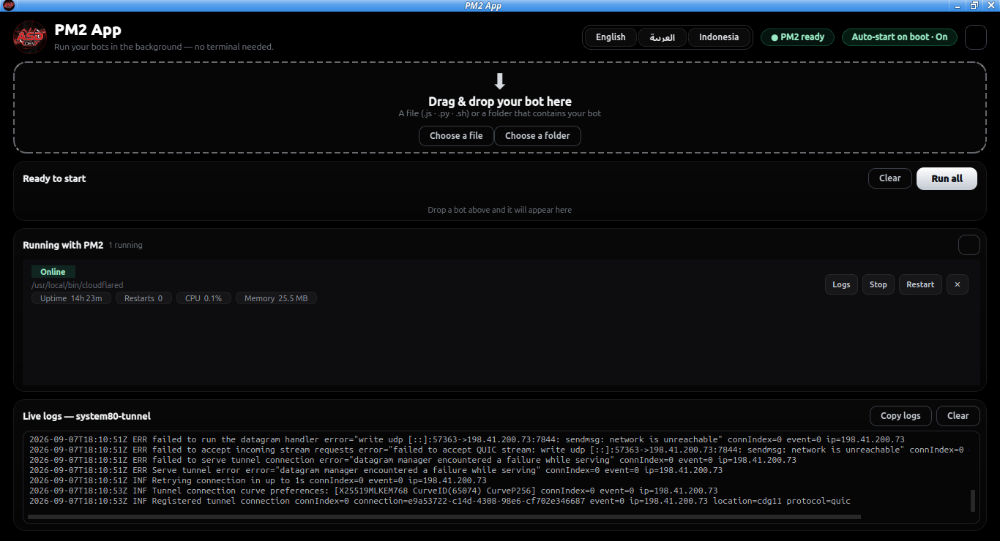

# ⚙️ PM2 App

**A friendly cross-platform desktop controller for PM2 — drag & drop your bot, and let it run in the background.**

PM2 App is a lightweight GUI that helps developers run and manage background
processes (Discord bots, scrapers, workers, API servers…) with
[PM2](https://pm2.keymetrics.io/), without ever touching a terminal.



---

## ✨ Features

| Feature | What it does |
|---|---|
| 🖱️ Drag & drop | Drop a `.js`, `.py` or `.sh` file — or a whole project folder |
| 📡 Live console | Select any app to stream its logs in **real time** |
| 🎛️ Full control | Start / Stop / Restart / Delete, uptime, CPU, memory |
| 👁️ Sees existing apps | Anything already running under PM2 appears automatically |
| 🌍 3 languages | English, العربية and Bahasa Indonesia (RTL support) |
| ⚡ Auto PM2 install | Installs PM2 for you if it's missing |
| 🚀 Auto-start on boot | Your bots come back after a PC restart |
| 🖥️ Cross-platform | Linux, Windows & macOS (PyQt6) |

---

## 📋 Requirements

| Dependency | Needed for |
|---|---|
| **Python 3.10+** | Running the app |
| **PyQt6** | The GUI (installed automatically, see below) |
| **Node.js + npm** | Required by PM2 |
| **PM2** | The process manager — the app can install it for you |

---

## 📥 Download & Run on Linux (complete guide)

### Option 1 — Download the ZIP (no git needed)

1. Go to the project page on GitHub.
2. Click the green **Code** button → **Download ZIP**.
3. Extract the ZIP, then open a terminal inside the extracted `PM2-App` folder:

```bash
cd ~/Downloads/PM2-App        # ← path of the extracted folder
```

### Option 2 — Clone with git

```bash
git clone https://github.com/samehr833/PM2-App.git
cd PM2-App
```

### Then install the dependencies and run

**Ubuntu / Debian:**

```bash
sudo apt update
sudo apt install -y python3 python3-pyqt6 nodejs npm
```

**Fedora:**

```bash
sudo dnf install -y python3 python3-qt6 nodejs npm
```

**Arch Linux:**

```bash
sudo pacman -S --noconfirm python python-pyqt6 nodejs npm
```

**openSUSE:**

```bash
sudo zypper install -y python3 python3-qt6 nodejs npm
```

**Any distro (universal method with venv):**

```bash
sudo apt install -y python3 python3-venv nodejs npm   # distro-specific part
python3 -m venv .venv
source .venv/bin/activate
pip install -r requirements.txt
python3 main.py
```

### Run

```bash
./run.sh
```

> 💡 **First run:** if PM2 is not installed yet, the app installs it for you
> automatically — you don't need to type anything. After that, drag & drop
> your bot and press **Run**.

### Optional: desktop shortcut (Linux)

```bash
chmod +x run.sh pm2-app.desktop
cp pm2-app.desktop ~/Desktop/
```

---

## 🪟 Windows

```cmd
:: 1. Install Python from https://python.org (tick "Add to PATH")
:: 2. Install Node.js from https://nodejs.org
:: 3. Run:
run.cmd
```

or manually:

```cmd
py -m pip install -r requirements.txt
py main.py
```

---

## 🍎 macOS

```bash
brew install python node
python3 -m venv .venv && source .venv/bin/activate
pip install -r requirements.txt
python3 main.py
# or simply: ./run.sh
```

---

## 🎮 Usage

1. Open the app — any process already running under PM2 appears instantly.
2. **Drag & drop** a bot file or folder into the box.
3. Press **Run** — PM2 starts it in the background.
4. Select an app to watch its **live console**.
5. Use **Stop / Restart / Delete** whenever you want.
6. Optional: enable **Auto-start on boot** so everything returns after a reboot.

Closing the app does **not** stop your bots — PM2 keeps them running.

---

## 📁 Supported files & folders

| Drop | How it is started |
|---|---|
| `bot.js` / `index.mjs` / `file.cjs` | `node <file>` |
| `bot.py` | `python3 <file>` (or `python` on Windows) |
| `script.sh` | `bash <script>` |
| A folder with `package.json` | the `main` entry (or `index.js`) |
| A folder with `main.py` / `bot.py` | run as Python |
| A folder with `index.js` / `main.js` | run as Node.js |

The working directory is always the bot's own folder, so relative paths inside
your code keep working.

---

## 🔧 Where things live

| What | Location |
|---|---|
| Logs | `~/.pm2/logs/` (managed by PM2) |
| App settings | `~/.config/PM2-App/settings.json` |
| PM2 boot dump | `~/.pm2/dump.pm2` |

---

## 🛠️ Project layout

```
PM2-App/
├── main.py         # entry point
├── mainwindow.py   # the whole GUI
├── pm2svc.py       # PM2 interaction layer (cross-platform)
├── i18n.py         # translations (en / ar / id)
├── theme.py        # stylesheet / visual theme
├── icon.png        # application icon
├── app.png         # README screenshot
├── requirements.txt
└── run.sh | run.cmd
```

---

## ⚖️ License — read before using

PM2 App is **open source** and free to **use, modify and share** for personal
and non-commercial purposes. However:

- ❌ **Commercial sale is strictly prohibited.** You may not sell PM2 App,
  or any modified copy of it, for money — directly or inside another product.
- ✅ **If you share or modify a copy**, you **must**:
  1. mention the original developer **Sameh Ayoub**, and
  2. include a link to this GitHub project in your copy.

Full terms are in the [LICENSE](LICENSE) file.

---

## 📬 Contact

For questions, suggestions or bug reports, contact the developer:

**Sameh Ayoub** — awabsameh98@gmail.com

Issues and pull requests are also welcome on GitHub.

---

## 🌍 README — العربية

# ⚙️ تطبيق PM2

**واجهة سطح مكتب سهلة لإدارة PM2 — اسحب بوتك وأفلته، وخلّه يعمل في الخلفية.**


تطبيق خفيف يساعد المطورين على تشغيل وإدارة البرامج التي تعمل في الخلفية
(بوتات ديسكورد، سكربتات، خوادم API …) عبر PM2 دون الحاجة إلى الطرفية.

### التحميل والتشغيل (لينكس)

```bash
# حمّل المشروع: زر Code الأخضر ← Download ZIP ثم فك الضغط، أو:
git clone https://github.com/samehr833/PM2-App.git
cd PM2-App

# ثبّت المتطلبات (أوبونتو / ديبيان مثلًا):
sudo apt update
sudo apt install -y python3 python3-pyqt6 nodejs npm

# شغّل:
./run.sh
```

> 💡 في أول تشغيل، إذا لم يكن PM2 مثبّتًا سيثبّته التطبيق لك تلقائيًا.

### الاستخدام
1. افتح التطبيق — ستظهر أي بوتات تعمل عبر PM2 فورًا.
2. اسحب ملف بوتك إلى الصندوق.
3. اضغط «تشغيل» ليعمل في الخلفية.
4. اضغط على أي تطبيق لمشاهدة سجلاته مباشرة.
5. تحكم به عبر «إيقاف / إعادة تشغيل / حذف».
6. فعّل «التشغيل التلقائي عند فتح الجهاز» لتستمر بوتاتك بعد إعادة التشغيل.

إغلاق التطبيق لا يوقف بوتاتك — PM2 يبقيها تعمل.

### الترخيص
التطبيق **مفتوح المصدر** ومجاني للاستخدام الشخصي وغير التجاري، لكن:
- ❌ **يُمنع البيع التجاري** — لا يجوز بيع التطبيق أو أي نسخة معدّلة منه.
- ✅ **عند المشاركة أو التعديل** يجب ذكر المطور الأصلي **سامح أيوب** وإضافة
  رابط المشروع على GitHub في نسختك.

### للتواصل مع المطور
**سامح أيوب** — awabsameh98@gmail.com

---

**Made by Sameh Ayoub** · awabsameh98@gmail.com
